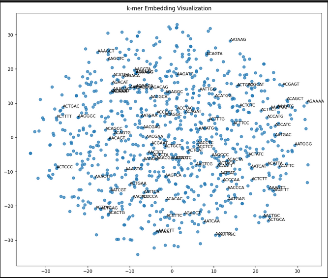

# 🧬 BioSkipGram

A minimal, from-scratch implementation of the Skip-Gram Word2Vec model trained on **DNA coding sequences (CDS)** using PyTorch.  
This project explores how NLP techniques can be applied to biological sequences to learn meaningful embeddings of k-mers.

---

## 🚀 Project Structure

BioSkipGram/

│

├── BioSkipgram.ipynb # Colab notebook for training and plotting embeddings

├── SkipGram.py # Core implementation of Skip-Gram model using PyTorch

├── plot.png # Sample 2D visualization of k-mer embeddings (t-SNE or PCA)

└── README.md # Project description and usage guide


---
## Dataset 

Download dataset from here :
[Homo Sepiens Dataset](https://www.ncbi.nlm.nih.gov/datasets/genome/GCF_000001405.40/)

## 📌 What This Does

- Loads genomic coding sequences from **Homo sapiens** (FASTA format)
- Tokenizes them into **k-mers** (subsequences of length k)
- Trains a custom **Skip-Gram Word2Vec model** on the k-mer corpus
- Outputs learned embedding vectors and a visualization

---

## 🧠 Significance

DNA, like natural language, has structure and patterns.  
By treating k-mers like "words", this project learns semantic relationships between subsequences, potentially useful for:

- Mutation detection
- Functional annotation
- Sequence similarity search
- Protein/DNA modeling pipelines

---

## 📈 Output



---

## 🛠 How to Run

```bash
# Clone the repo
git clone https://github.com/yourusername/BioSkipGram.git
cd BioSkipGram

# (Optional) Install dependencies
pip install torch matplotlib numpy

# Run the notebook (Colab recommended)
Open BioSkipgram.ipynb

```
## 📚 Credits

    Genomic data from NCBI (CDS FASTA for Homo sapiens) 
    link : https://www.ncbi.nlm.nih.gov/datasets/genome/GCF_000001405.40/

    Inspired by the original Word2Vec (Mikolov et al.)

## 🧪 Future Ideas

    Batch loading FASTA sequences

    Adding negative sampling / subsampling

    Comparing gensim vs. custom implementation

    Applying embeddings to classify genes or detect patterns
